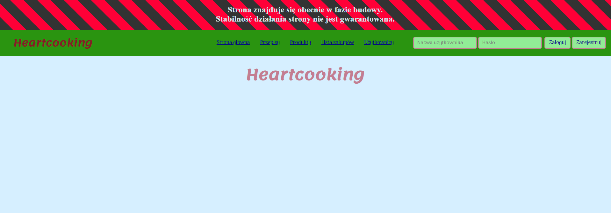
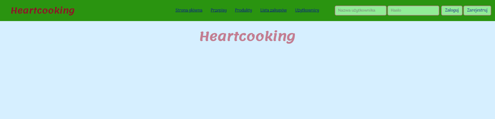

# Heartcooking
A project to improve skills at ASP.NET Core and Angular  
This will be a social web app to sharing cooking recipes with friends  
It will also allow to calculate kcals, proteins, etc. for meals  
One of the features will be creating shopping list from chosen meals   

## Used technologies:
- ASP.NET Core 3.1
- Entity Framework Core 3.1
- Angular 8
- Git
- HTML
- CSS
- Azure DevOps
- Azure Cloud

## Builds Statuses on Azure Pipeline:

### Backend build: 

### Frontend build: 

 

## Link to Kanban board on Trello 

[Kanban board](https://trello.com/b/lLBywiK5/heartcooking)

 

## Link to Azure DevOps project
[Azure DevOps](https://dev.azure.com/pawelzajglicz/Heartcooking)

### Azure boards:  

 

## Link to developer version of application deployed on Azure
[Early developer version of application](https://heartcooking-front.azurewebsites.net)

 

## Preview 
(Project is still at early development stage)

  
